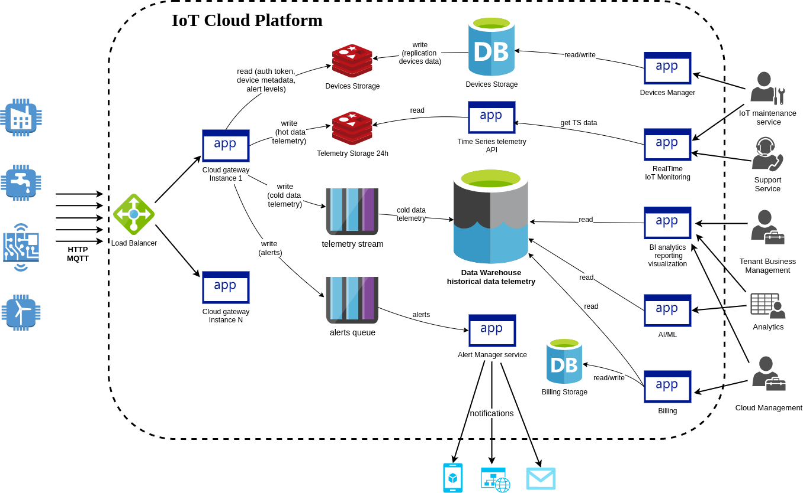
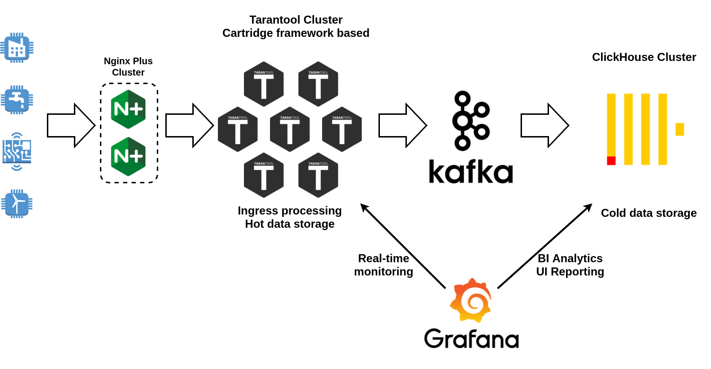
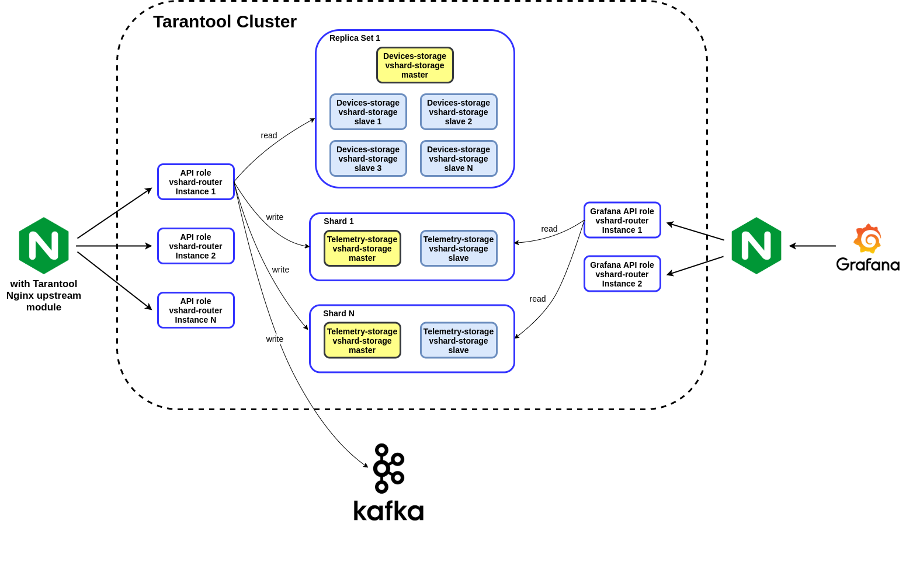

# IoT Cloud Platform

## Goals

* handle highload telemetry requests (successfully passing 100-200k+ RPS load testing in one machine)
* horizontal scalability of all components
* implement user experience (real-time IoT-monitoring, BI-analytics, data-visualization)
* cheap solution 

# System Design

# Technology stack

# Tarantool cluster topology

